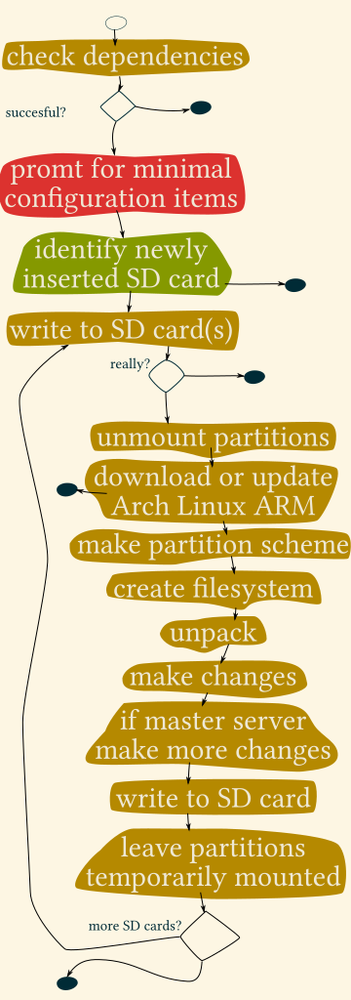

The script needs to be run on a Linux installation and was tested with bash.

It check the dependencies 

- wget
- fdisk
- curl
- bsdtar
- dd
- git
- lsblk

and fails if one or more of them are not installed.

## Configuration Items ##

It tries to detect the remote Github repository URL as a suggestion when prompting for these configuration items:

- remote GitHub repository
- its branch

- how many nodes in total the cluster shall have (up to 9)
- the hostname of the special master node that has additional roles
- and a prefix for the hostnames of the other nodes (it will be appended with 1, 2, …, 9)

- a network segment in CIDR notation
- the start of the DCHP range
- and its end
- a fully qualified domain name

These configuration items are used as parameters to call the SD card setup script, and written onto the card's filesystem for future reference.

It will detect the block device name of SD cards when prompted to remove and re-insert a SD card.

It computes the IP address of the special master node as xxx.yyy.zzz.1 and sets the network segment to a /24 subnet of 255.255.255.0 (this is just because it is easy in bash to do).

### Default values ###

| variable name | getopts parameter | default |
|---------------|-------------------|---------|
| __GITREMOTEORIGINURL | https://github.com/helotism/helotism.git | -r |
| __GITREMOTEORIGINBRANCH | master | -g |
| __COUNT | 2 | -c |
| __MASTERHOSTNAME | axle | -m |
| __HOSTNAMEPREFIX | spoke0 | -n |
| __NETWORKSEGMENTCIDR | 10.16.6.1/24 | -s |
| __DHCPRANGESTARTIP | 10.16.6.100 | -a |
| __DHCPRANGEENDIP | 10.16.6.200 | -o |
| __FQDNNAME | wheel.example.com | -d |
| __BLOCKDEVICE | /dev/null | -b |

It will also prepare a user with full sudo rights names helotism and the password helotism. This user is not activated by default though.

With these configuration items the SD card setupt script is called. It is possible to do so directly with the necessary parameters. This comes in handy to add just one other node.

```
./application/physical/scripts/bootstrap-arch.sh -d wheel.prdv.de -m axle -s 10.16.13.1/24 -c 4 -n cog0 -b /dev/nall
```

At several times during the installation the scripts asks for user confirmation. It is possible to

- exit the process at several points
- and also to skip one or more SD cards

The following graphic wants to put the user's mind at ease about a block-device-overwriting script:

